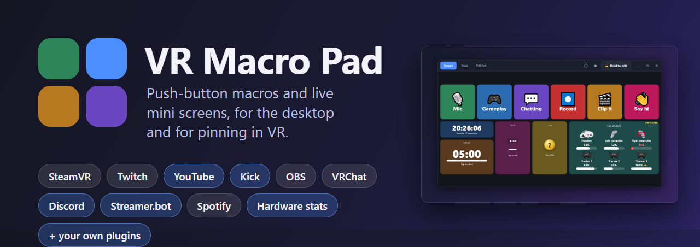
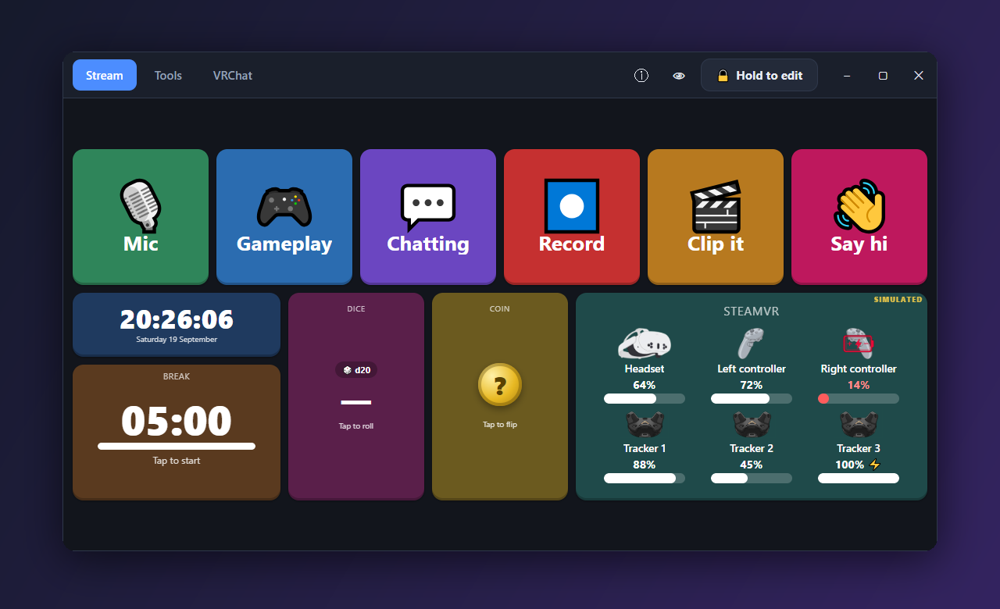
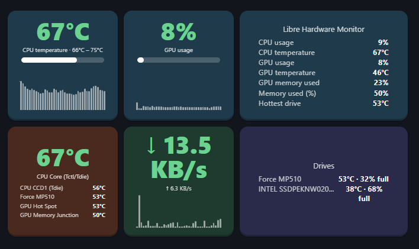
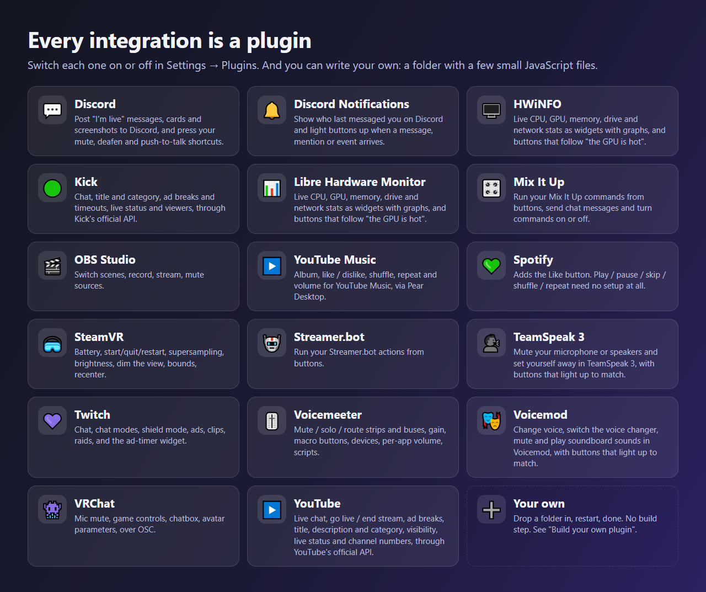
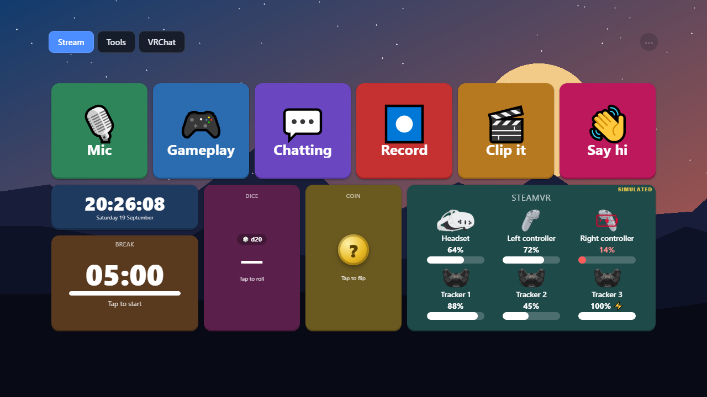

<div align="center">



# VR Macro Pad

**Colored push-button macros and live mini screens for Windows.**
Use it on your desktop, or float it in VR as a real **SteamVR overlay**.

[](https://github.com/Jayconius/VRMacroPad/releases/latest)
[](LICENSE)
[](#-download)

[](https://github.com/Jayconius/VRMacroPad/releases)
[](https://github.com/Jayconius/VRMacroPad/stargazers)
[](https://www.electronjs.org)
[](#-use-it-in-vr)

[Website](https://vrmacropad.jayconius.com) · [Download](https://github.com/Jayconius/VRMacroPad/releases/latest) · [Build a plugin](docs/BUILD-A-PLUGIN.md) · [Full guide](docs/GUIDE.md)

</div>

---

<p align="center"></p>

## ✨ What is it?

A grid of big, colored buttons that run macros, plus **mini screens** that show live information (SteamVR battery, the song playing, your stream's ad timer and viewers, a clock, dice...). Press a button and it mutes your mic, switches your OBS scene, sends a chat message on Twitch, Kick or YouTube, changes your Voicemod voice, shows your CPU and GPU temperature live, changes your Voicemeeter volume, posts "I'm live" to Discord, jumps in VRChat, and much more.

It is a **native SteamVR overlay**: grab it, move it, resize it, snap it to your wrist, or leave it in the room, all from inside VR, and edit everything without taking the headset off. No VR? It works just as well as a desktop window (and you can hide that window if you only use VR).

<p align="center"></p>

## 🆕 What's new in 3.0.2

<p align="center"></p>

* 📊 **Libre Hardware Monitor** and 🖥️ **HWiNFO** (new): live **CPU, GPU, memory, drive and network stats** as mini screens. A stat with a small graph that turns amber and red when it gets hot (CPU / GPU temperature and usage, GPU memory, power, clock, fan, memory used, drive temperature, network speed, or any sensor you pick), an overview list, "hottest parts", network speed and drives. Buttons can also light up on **"the CPU is hot"**, **"the GPU is hot"**, **"a drive is hot"** or **"memory is nearly full"**, and a button can pop a stat up. Read-only: nothing on your PC is changed.
* Pick whichever you like: **Libre Hardware Monitor** is free with no time limit (turn on its Remote Web Server). **HWiNFO** needs *Shared Memory Support* ticked and HWiNFO **restarted once**; the free version switches it off again after 12 hours, HWiNFO Pro does not.
* 🧩 Plugin authors: a widget can now draw a small graph (`spark`). See the [Plugin reference](docs/PLUGIN-GUIDE.md).

## What's new in 3.0.1

* 🎭 **Voicemod** (new): change voice (the whole list, or only Voicemod's or your Community voices), random voice, voice changer / mute / hear-myself / background effects on and off with buttons that light up to match, and play any soundboard sound (all sounds, or one soundboard: yours are found by themselves and listed first). Needs a Voicemod client key: press **Instructions** on the Voicemod card.
* 🗣️ **TeamSpeak 3** (new): mute your microphone or speakers and set yourself away, with buttons that follow your real TeamSpeak state. TeamSpeak 5 / 6 have no way for other apps to control them.
* 🎛️ **Mix It Up** (new): run your Mix It Up commands, send a chat message, clear chat, and turn commands on or off, through its Developer API.
* 🔎 **Better pick lists everywhere**: long lists (voices, sounds, scenes, actions) scroll, open showing everything, and narrow as you type, with several words in any order ("demon radio" finds "Radio Demon").

## 🆕 What's new in 3.0

**Everything is a plugin now.** OBS, Twitch, VRChat, Spotify, SteamVR, Voicemeeter and the rest were moved out of the app's core into plugins that you can switch on and off, and you can write your own.

<p align="center"></p>

* 🧩 **A real plugin system.** A plugin is a folder with a few small JavaScript files: no build step, no touching the app. Drop it in, restart, and it has its own settings card, actions, mini screens, sign-in and connection status. Start with the step-by-step tutorial: **[Build your own plugin](docs/BUILD-A-PLUGIN.md)**.
* 💬 **Discord** (new): post "I'm live" messages, cards and screenshots through a webhook, share a new Steam screenshot or your last VRChat photo, and press your Discord mute / deafen / push-to-talk shortcuts.
* 🔔 **Discord Notifications** (new): mini screens that show who last messaged you, with filters for DMs, `@everyone`, `@you` and server events, and buttons that light up on a new message.
* 🟢 **Kick** (new): chat, title and category, ad breaks and timeouts, live status and viewers, through Kick's official API. Press **Connect** and log in on Kick.
* 🤖 **Streamer.bot** (new): run your Streamer.bot actions from a button (emote-only, slow mode, clear chat, anything you built), by name and grouped like in Streamer.bot itself. It uses Streamer.bot's normal WebSocket server, so it works with the default settings and no password.
* ▶️ **YouTube** (new): live chat, go live and end stream, ad breaks, title, description and category, public / unlisted / private, plus live-status and channel-number mini screens. See the note below about signing in.
* 📐 **Any grid size**, up to 100 × 100, with **"Fit the whole page on screen"** so a big grid shrinks to the window instead of scrolling.
* ↩️ **A Back button in the action picker**, so after picking something you land where you were in the long list.
* 🔄 **Optional update check** (off by default): Settings → General → *Check for updates*. When a new version is out you get a box with a link, a **Download** button and a **Skip** button. Portable copies save the new exe next to the old one; installed copies can install it and restart for you.
* 🔌 **One connections icon** in the top bar (dot and count) that opens a list, instead of one chip per plugin.
* 📖 **"Instructions" buttons** on plugins that need a one-time setup, with numbered steps, links that open in your browser, and Copy buttons.
* 🎙️ Mic and speaker buttons tied to a device now follow that device's real Windows mute state.
* 🌐 A website with the privacy policy and terms: [vrmacropad.jayconius.com](https://vrmacropad.jayconius.com).

> [!NOTE]
> **YouTube sign-in:** the one-click *Log in with Google* is **not available yet**. It is waiting for Google to verify the app, which I can't rush. **The YouTube plugin still works today**: open Settings → Plugins → YouTube, press **Instructions**, and follow the steps to make your own free Google app (about five minutes, no cost), then paste its Client ID and Secret. Once Google verifies the app, it will become a single button.

Everything from 2.0 is still here: the native SteamVR overlay with its dashboard entry and in-VR editor, button effects, your own pictures and GIFs, Voicemeeter, the SteamVR functions, VRChat OSC, and the buttons-only view. [VR overlay guide](docs/VR-OVERLAY.md)

## 📥 Download

| | |
|---|---|
| 💿 **[Installer](https://github.com/Jayconius/VRMacroPad/releases/latest)** | Start menu + desktop shortcut, uninstaller. `VR-Macro-Pad-Setup-x.y.z.exe` |
| 🎒 **[Portable](https://github.com/Jayconius/VRMacroPad/releases/latest)** | One file, nothing to install, run it from anywhere. `VR-Macro-Pad-x.y.z-portable.exe` |

> [!NOTE]
> The exes are not code-signed yet, so Windows SmartScreen may say *"unknown publisher"*. Click **More info → Run anyway**.
> The first start takes a few seconds while it builds its small Windows helper programs.
> Your layout and settings live in `%APPDATA%\VR Macro Pad`, so updating (or switching between installer and portable) keeps them.

## 🚀 Quick start

1. **Start it.** You get a starter layout with a mic button, volume, media and a few tools.
2. **Press a button** to run it. Buttons light up to match reality (mic muted, recording, emote-only on...).
3. **Hold the 🔒 button for a second** to unlock editing. Then drag buttons to move them, drag a corner to resize, click one to edit it, or press **＋ Add button**.
4. It locks itself again a few minutes later, so a stray click in VR can never rearrange your deck.

## 🎛️ What can a button do?

| | |
|---|---|
| 🎙️ **Audio** | mic mute, output mute, switch devices, volume, per-app volume |
| ⌨️ **Keyboard & system** | shortcuts, type text, media keys, launch programs, open links |
| 🥽 **SteamVR** | start / quit / restart, battery on a mini screen, supersampling, motion smoothing, brightness, dim the view, play-area bounds, performance graph, recenter |
| 🎚️ **Voicemeeter** | mute / solo / route, gain and fades, macro buttons, recorder, audio devices, per-app volume, any script |
| 🎬 **OBS** | switch scene, record, stream, save replay, mute a source |
| 👾 **VRChat** | mic mute, chatbox (with song / time), avatar parameters and steps, game controls, walk / turn, any OSC message |
| 💜 **Twitch** | chat messages, emote-only, followers-only, shield mode, ads, clip, raid, title... |
| 🟢 **Kick** | chat, title and category, ad breaks, timeouts |
| ▶️ **YouTube** | live chat, go live / end stream, ad breaks, title / description / category, public / unlisted / private |
| 🤖 **Streamer.bot** | run any of your Streamer.bot actions |
| 🎛️ **Mix It Up** | run your commands, send a chat message, clear chat, turn commands on or off |
| 📊 **Libre Hardware Monitor** | live CPU, GPU, memory, drive and network stats, and buttons that follow "the GPU is hot" |
| 🖥️ **HWiNFO** | the same stats from HWiNFO's Shared Memory Support |
| 🎭 **Voicemod** | change voice, random voice, voice changer / mute / hear-myself / background effects, play or stop soundboard sounds |
| 🗣️ **TeamSpeak 3** | mute your microphone or speakers, set yourself away |
| 💬 **Discord** | post messages, cards and screenshots, share a Steam screenshot or VRChat photo, mute / deafen / push-to-talk |
| 🎵 **Spotify** | play / skip, shuffle, repeat, seek, volume, and Like |
| ▶️ **YouTube Music** | through [Pear Desktop](https://github.com/pear-devs/pear-desktop): like, shuffle, repeat, volume |
| 🏠 **Web & smart home** | webhooks, Home Assistant |

Every button is a list of steps with optional delays. Give it a **picture or GIF** (a different one when active), and an **animation** for its states (pulse, flash, glow, ripple, hazard stripes...) so a live mic or a running stream cannot be missed. It can also fire **on its own**: a hotkey, an app starting or closing, a state changing (recording started, low battery, ad coming up...), or a time of day.

## 📺 Mini screens

Buttons that show live information instead of just running steps:

| | |
|---|---|
| 🕒 **Clock**, ⏳ **Timer**, ⏱️ **Stopwatch** | timers survive restarts and can run actions when they finish |
| 🪙 **Coin flip**, 🎲 **Dice** | d4 to d100, advantage / disadvantage, and they can post the result to Twitch chat |
| 🔋 **SteamVR battery** | headset, controllers, trackers and base stations, as a list or as **pictures** |
| 🎶 **Now playing** | album cover, title, progress, controls. Spotify and most players |
| 📺 **Stream status** | Twitch, Kick and YouTube: live badge, viewers, uptime, and the countdown to your next ad |
| 🔔 **Discord messages** | who last messaged you, and buttons that light up on a new one |
| 📊 **Hardware stats** | CPU / GPU temperature and usage with a live graph, overview, hottest parts, network speed, drives. From Libre Hardware Monitor or HWiNFO |

## 🫥 Buttons only (see-through)

One click on the 👁 button (or **Ctrl+Alt+Shift+V**) makes everything **except your pages and buttons fully transparent**, so they float over your game or desktop.

<p align="center"></p>

## 🥽 Use it in VR

1. Settings → **VR overlay** → *Show the deck in SteamVR*, then start SteamVR. (The app never starts SteamVR itself.)
2. Point a controller at the deck and pull the trigger. Hold the trigger on the dotted handle to **grab** it; carry it to your other wrist and let go to **snap** it there.
3. Open the SteamVR menu: **VR Macro Pad** is in the bar at the bottom, with **Controls** and a full **Editor**.

It works next to XSOverlay and OVR Toolkit and with any SteamVR headset (Quest over Link / Air Link / Virtual Desktop, Index, Vive, Steam Frame streaming...). The full guide is [docs/VR-OVERLAY.md](docs/VR-OVERLAY.md).

Prefer a window capture? The desktop window still works with **OVR Toolkit / XSOverlay / Desktop+**, and clicking it does **not** steal focus from your game.

<details>
<summary><b>🔌 Setting up OBS, VRChat, Twitch, Kick, YouTube, Streamer.bot, Mix It Up, Voicemod, TeamSpeak 3, Libre Hardware Monitor, HWiNFO, Discord, Spotify Like, Pear...</b></summary>

<br>

Open **Settings → Plugins** and expand the plugin. Ones that need a one-time setup have an **Instructions** button.

| | How |
|---|---|
| **OBS** | Tools → WebSocket Server Settings → enable. Enter the port and password on the OBS card. |
| **VRChat** | Action Menu → Options → OSC → Enabled. |
| **Twitch** | **Connect Twitch**, then approve on twitch.tv. Nothing else to set up. |
| **Kick** | **Connect Kick**, then log in and approve on kick.com. Nothing else to set up. |
| **YouTube** | Not one-click yet (Google's verification is pending). Press **Instructions** on the YouTube card, make your own free Google app, paste its Client ID and Secret, then **Connect YouTube**. |
| **Streamer.bot** | In Streamer.bot: Servers/Clients → WebSocket Server → start it (the defaults are fine). Then the plugin lists your actions. Only fill in a password if you turned on *Authentication*. |
| **Mix It Up** | In Mix It Up: Services → Developer API → Connect. Then **Save and test connection** on the Mix It Up card. |
| **Voicemod** | Voicemod's Control API needs a client key, which you ask Voicemod for (the **Instructions** button has the link). Paste it on the Voicemod card and press **Save and test connection**. A sound or soundboard you have just added only shows up after it has been played once in Voicemod (then press ⟳). |
| **TeamSpeak 3** | In TeamSpeak 3: Tools → Options → Addons → ClientQuery → Settings, copy the API key into the TeamSpeak 3 card, connect to a server, then **Save and test connection**. |
| **Libre Hardware Monitor** | Run Libre Hardware Monitor (as administrator, so it can read every sensor), then Options → Remote Web Server → Run. Press **Save and test connection** on its card. |
| **HWiNFO** | In HWiNFO Settings (General / User Interface tab) tick **Shared Memory Support**, press OK, then **restart HWiNFO** (close it completely, also from the tray, and open it again) with its Sensors window running. The free version turns Shared Memory Support off after 12 hours: tick it again and restart. Then press **Save and test connection**. |
| **Discord** | Channel settings → Integrations → Webhooks → copy the webhook URL into the Discord card. The mute / deafen / push-to-talk buttons press the shortcuts you set in Discord. |
| **Spotify** | Play, skip, shuffle, repeat, seek and volume need **no setup and no login**. *Like* needs a one-time connection with your own Spotify developer app (see the [guide](docs/GUIDE.md#setting-up-the-integrations)). |
| **YouTube Music** | In Pear: Plugins → API Server → enable. Then **Connect Pear**. |
| **SteamVR** | Nothing. It only looks at SteamVR when something needs it, and never starts it. |
| **Voicemeeter** | Install [Voicemeeter](https://voicemeeter.com) (Standard, Banana or Potato) and start it. Nothing to configure. |

</details>

## 🔒 Privacy and safety

- Everything stays on your PC. The app runs a small web server on `127.0.0.1` only, protected by a secret token.
- Logins (Twitch, Spotify, Kick, YouTube...) are stored **encrypted with your Windows account**, never in your layout file, so sharing a layout never leaks them. The one exception: a *Client ID / Secret* you type into a plugin's settings box is saved in your settings file in plain text (and is left out when you export a layout).
- Kick's and YouTube's one-click sign-in goes through a tiny free relay that only swaps the sign-in code for a token (those services need a secret the app can't safely carry). It stores nothing. Details: [Privacy policy](https://vrmacropad.jayconius.com/privacy.html).
- The update check is **off by default**. When on, it asks GitHub for the latest release number and nothing else, and it downloads only from this project's releases, verifying size and checksum first.
- Editing (and linking accounts) is locked by default and can be limited to a hotkey or the tray menu.

## ⚠️ Honest limits

- **Windows only.**
- **YouTube's one-click sign-in is not available yet** (waiting on Google's app verification). Use your own Google app for now (Instructions button). Once verified, anyone will be able to log in with one click, and it will still show Google's normal permission screen.
- **Hardware stats** were tested against a real Libre Hardware Monitor and a real HWiNFO. Which sensor counts as "the CPU temperature" is picked automatically (the package temperature, or the GPU that is busiest); any reading can be picked by hand instead. HWiNFO must be restarted after Shared Memory Support is ticked, and the free version stops sharing after 12 hours.
- **Tried less in 3.0.1:** Voicemod was tested against a real Voicemod. **Mix It Up** and **TeamSpeak 3** were built from their official documentation and tested against stand-ins, not yet against the real apps. Reports welcome!
- Voicemod only tells other apps about a sound after it has been played once in Voicemod, and never says which **voices** are on a soundboard (only which sounds), so voices have no soundboard lists.
- The YouTube plugin has no actions that target one viewer (bans, timeouts) on purpose, and Kick has no ban / unban either: they are slow and error-prone to do from inside VR.
- Tried on real hardware: the overlay, the dashboard entry and editor. **Not tried on real hardware yet:** the SteamVR battery screen, Voicemeeter (built against VB-Audio's official documentation and a built-in test double), headset brightness (depends on the headset's driver; "Dim the view" works everywhere), and the SteamVR keyboard in the VR editor. Reports welcome!
- Spotify **Like** talks to Spotify's Web API, which (since Feb 2026) only lets a development-mode app work while its owner has Premium, for up to 5 people. So each person uses their own Client ID.
- Keystrokes can't be sent into programs running as administrator unless VR Macro Pad runs as administrator too.
- The overlay needs SteamVR. There are no controller bindings yet (grab and click use the laser and trigger).
- The "install and restart" update path (installed copies) has had less real-world testing than the rest; if it ever misbehaves, download the Setup from the release page and run it yourself.
- OVR Advanced Settings cannot be controlled from other apps, so its features are done directly where SteamVR allows (supersampling, brightness, bounds...). VRChat's web API (friends, status) is not used.

## 🧩 Write your own plugin

Every integration above is a plugin, and yours works exactly the same way: a folder with a few small JavaScript files, no build step. Two guides:

- 📘 **[Build your own plugin](docs/BUILD-A-PLUGIN.md)**: a step-by-step tutorial (a real Discord webhook example), a cookbook (settings, logins, polling, mini screens, saving data) and a FAQ. Also as a [single web page](docs/BUILD-A-PLUGIN.html).
- 📗 **[Plugin reference](docs/PLUGIN-GUIDE.md)**: every field of `plugin.js`, the runtime API, and how the app loads plugins.
- Working examples live in [`docs/example-plugin`](docs/example-plugin), [`docs/example-plugin-discord`](docs/example-plugin-discord) and [`docs/example-plugin-login`](docs/example-plugin-login) (a full sign-in flow against a fake service).

## 🛠️ Build it yourself

```bash
git clone https://github.com/Jayconius/VRMacroPad.git
cd VRMacroPad
npm install
npm start          # run it
npm test           # 388 tests
npm run dist       # build the installer and portable exe into dist/
```

Needs [Node.js](https://nodejs.org). The full guide (every setting, how to add an action or a mini screen) is in **[docs/GUIDE.md](docs/GUIDE.md)**.

Two files are deliberately **not** in the repository: the address of the private sign-in relay for Kick and YouTube (`plugins/kick/kick-app.json`, `plugins/youtube/youtube-app.json`; examples sit next to them). Without them, a source build still works, and Kick / YouTube use your own developer app.

## 🙏 Credits

- [OpenVR SDK](https://github.com/ValveSoftware/openvr) by Valve (BSD-3), used for the overlay and to read SteamVR batteries and settings.
- [Voicemeeter](https://voicemeeter.com) and its Remote API by VB-Audio (the API is used through the DLL that comes with Voicemeeter; nothing of theirs is bundled).
- The device pictures come from the author's other app, [OhFudgeMyBatteryChat](https://github.com/Jayconius/OhFudgeMyBatteryChat) (MIT).
- Built with [Electron](https://www.electronjs.org) and [ws](https://github.com/websockets/ws).

VR Macro Pad is an independent project. It is **not affiliated with** [Macro Deck](https://macro-deck.app) (a different app by SuchByte), Valve, Meta, Twitch, Kick, Google / YouTube, Discord, Streamer.bot, Spotify, OBS, VRChat or VB-Audio. Those names belong to their owners.

## 💬 Contact

Made by **Jayconius** ([jayconius.com](https://jayconius.com)) and **Claude**, an AI assistant from [Anthropic](https://www.anthropic.com). Jayconius came up with it and tested it in VR; Claude wrote the code, tests and docs.

Found a bug or want a feature? [Open an issue](https://github.com/Jayconius/VRMacroPad/issues).

[Privacy policy](https://vrmacropad.jayconius.com/privacy.html) · [Terms](https://vrmacropad.jayconius.com/terms.html)

## 📄 License

[MIT](LICENSE) © 2026 Jayconius
