# Build your own plugin

VR Macro Pad's integrations (OBS, Twitch, VRChat, Spotify…) are all plugins, and yours works exactly the
same way. You don't touch the app's source, install anything, or build anything. You write a few small
JavaScript files, drop the folder in, and restart.

In this guide you'll build a real one: a **Discord Webhook** plugin that posts a message to a Discord
channel when you press a button ("Going live now! 🔴"). Then there's a cookbook of the other things a plugin
can do, a reference you can keep open while you work, and answers to the questions people ask most.

> **VR Macro Pad already includes a ready-made Discord plugin** (Settings → Plugins → Discord). This tutorial builds a
> smaller one called `mydiscord` from scratch, purely to teach you how plugins work, so its names never clash with the built-in one.
> Your own plugin needs its own unique `id`, so pick something that no other plugin uses.

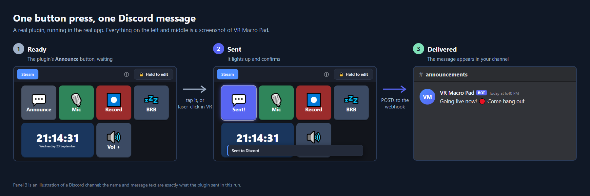

**Contents**

- [Before you start](#before-you-start)
- [Which kind of plugin?](#which-kind-of-plugin)
- **Part 1: build the Discord plugin**
  [1 Folder](#step-1-make-the-folder) ·
  [2 Manifest](#step-2-pluginjs-the-manifest) ·
  [3 Runtime](#step-3-runtimejs-the-part-that-does-the-work) ·
  [4 Actions](#step-4-actionsjs-what-a-button-can-do) ·
  [5 Restart](#step-5-restart-and-set-it-up) ·
  [6 Use it](#step-6-put-it-on-a-button)
- **Part 2: cookbook**
  [Settings and choices](#ask-the-user-for-choices) ·
  [Lighting up buttons](#make-buttons-light-up-and-fire-triggers) ·
  [Saving data](#save-data-between-restarts) ·
  [Polling and connections](#keep-a-connection-or-poll-a-service) ·
  [Mini screens](#add-a-mini-screen-widget) ·
  [Logins](#sign-in-to-an-account) ·
  [npm packages](#use-npm-packages)
- **Part 3**
  [Reference](#reference) ·
  [Testing and debugging](#testing-and-debugging) ·
  [Sharing your plugin](#sharing-your-plugin) ·
  [FAQ](#faq) ·
  [Troubleshooting](#troubleshooting) ·
  [Need a hand?](#need-a-hand)

---

## Before you start

**You need**

- VR Macro Pad 3.0 or newer (the version with plugins)
- A text editor (Notepad works; [VS Code](https://code.visualstudio.com/) is nicer because it colors your code and shows typos)
- For this tutorial: a Discord server where you can make a webhook

**You don't need** Node.js installed, `npm install`, a build step, or any knowledge of the app's source code.
Plugins are plain JavaScript that the app itself runs (it includes Node 20, so modern JavaScript, `async`/`await`
and `fetch` all work).

**Some JavaScript helps, but you can copy and adapt.** If you can read `if`, `function` and `{ key: value }`,
you can follow this. If not, see [Need a hand?](#need-a-hand) at the bottom.

> **A plugin can do anything your PC can.** A plugin is code that runs inside VR Macro Pad with your
> user's permissions: it can read files, use the network and start programs. Only install plugins from
> people you trust, and read the code of anything you download. (More in [Sharing your plugin](#sharing-your-plugin).)

## Which kind of plugin?

Every plugin is the same three files. What differs is what the middle one, `runtime.js`, does. Find yours:

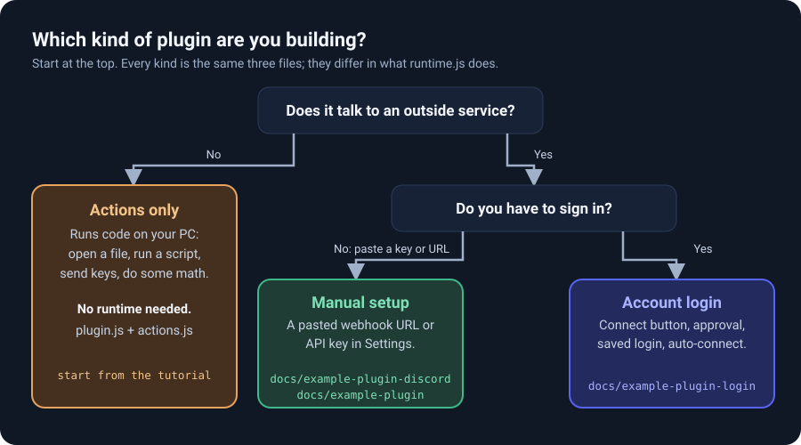

The Discord webhook plugin in Part 1 is **manual setup**: you paste a URL once, and there's nothing to sign
in to. Everything you learn carries over to the other two.

---

# Part 1: Build the Discord plugin

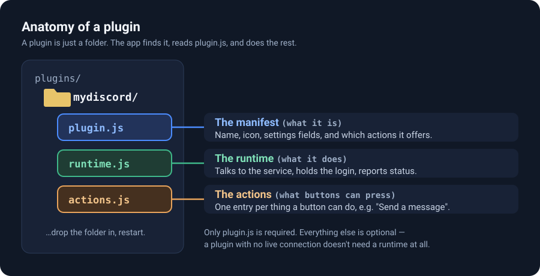

## Step 1: Make the folder

Plugins live in a `plugins` folder inside the app's data folder. On Windows that is:

```
%APPDATA%\VR Macro Pad\plugins\
```

Paste that into the File Explorer address bar and press Enter. If there's no `plugins` folder yet, create one.
Inside it, make a folder for your plugin. The folder's name doesn't matter (the plugin's `id` in the next step
does), but it must be a folder of its own, with the files **directly inside**:

```
%APPDATA%\VR Macro Pad\plugins\
└── mydiscord\
    ├── plugin.js      ← Step 2
    ├── runtime.js     ← Step 3
    └── actions.js     ← Step 4
```

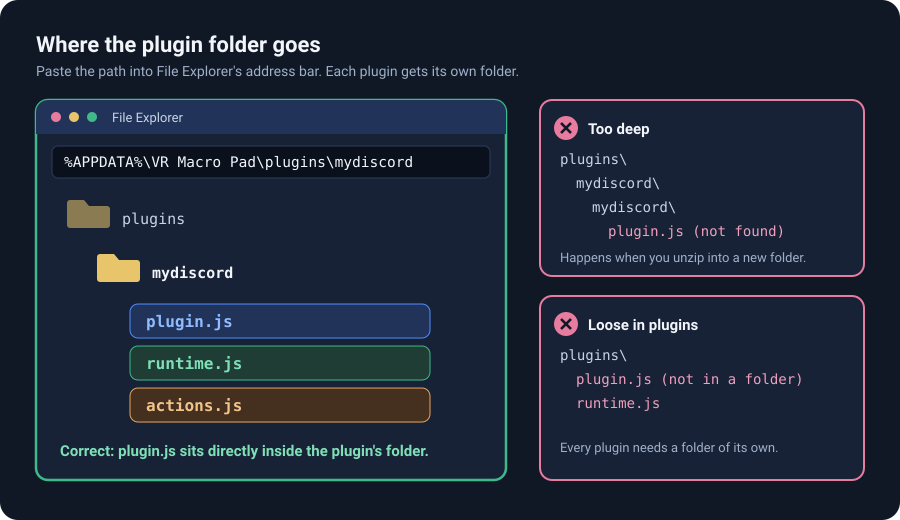

The two mistakes in that picture cause most "my plugin isn't showing up" reports. Zip files are the usual
culprit: extracting `mydiscord.zip` often makes `mydiscord\mydiscord\plugin.js`.

## Step 2: `plugin.js`, the manifest

This file **describes** your plugin. The app reads it to build the Settings screen and the list of things a
button can do. It doesn't do any work itself.

```js
const { DiscordRuntime } = require('./runtime');

module.exports = {
  id: 'mydiscord',                       // unique: lowercase letters, numbers, hyphens
  name: 'My Discord Webhook',
  version: '1.0.0',
  description: 'Post a message to a Discord channel with one button.',
  icon: '💬',

  // Shown at the top of the plugin's card in Settings.
  instructions: () => 'In Discord: channel settings → Integrations → Webhooks → New Webhook → Copy Webhook URL, then paste it below.',

  // Every entry becomes a field in Settings → Plugins. Values are saved for you.
  settingsFields: [
    { key: 'webhookUrl', label: 'Webhook URL', type: 'password', placeholder: 'https://discord.com/api/webhooks/…', help: 'Anyone with this URL can post to the channel, so it is kept out of exported layouts.' },
    { key: 'username', label: 'Post as', type: 'text', default: 'VR Macro Pad', help: 'The name shown next to the message.' },
  ],

  // Adds a "Save and test connection" button that calls this list (see Step 3, check()).
  testOptionKind: 'mydiscord.test',
  optionLists: {
    'mydiscord.test': (ctx) => ctx.plugins.get('mydiscord').check(),
  },

  actions: require('./actions'),       // Step 4

  // Lets buttons light up when this value is true (the runtime sets it).
  stateKeys: [
    { key: 'mydiscord.lastOk', label: 'The last Discord message was delivered', group: 'My Discord' },
  ],

  createRuntime(ctx) {
    return new DiscordRuntime(ctx);    // Step 3
  },
};
```

Only `id` and `name` are required. The rest is optional. This file must be **CommonJS** (`module.exports`
and `require`, as above). ES module `import` isn't supported.

Fields with `type: 'password'` are masked on screen and blanked when someone exports their layout, so a
secret never ends up in a file they share.

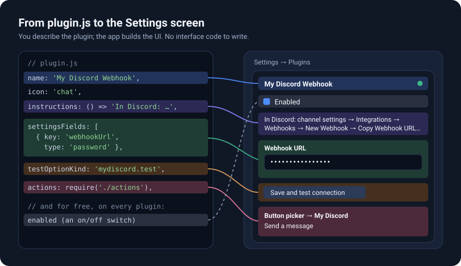

Every plugin also gets an **Enabled** switch for free. You don't declare it.

## Step 3: `runtime.js`, the part that does the work

The runtime is a class the app creates once at startup. It talks to the outside world and holds any state. This
plugin has no connection to keep alive, so it only needs a few methods:

```js
const HOSTS = new Set(['discord.com', 'discordapp.com', 'ptb.discord.com', 'canary.discord.com', '127.0.0.1', 'localhost']);

class DiscordRuntime {
  constructor(ctx) {
    this.ctx = ctx;
    this.hub = ctx.hub;
    this.last = { state: 'off', error: '' };   // off | connected | error
    this.hub.set('mydiscord.lastOk', false);       // known from the start, so the button isn't dimmed as "unknown"
  }

  // The status dot in Settings and the Info dialog read this.
  status() {
    return { state: this.last.state, error: this.last.error };
  }

  // ctx.settings() always returns the current values of your settingsFields.
  url() {
    const raw = String(this.ctx.settings().webhookUrl || '').trim();
    if (!raw) throw new Error('Paste your Webhook URL first (Settings → Plugins → My Discord Webhook).');
    let u;
    try { u = new URL(raw); } catch { throw new Error('That Webhook URL is not a valid link.'); }
    if (!HOSTS.has(u.hostname)) throw new Error('That is not a Discord webhook URL.');
    if (u.protocol !== 'https:' && u.hostname !== '127.0.0.1' && u.hostname !== 'localhost') throw new Error('The Webhook URL must start with https://');
    return u.toString();
  }

  record(ok, error = '') {
    this.last = { state: ok ? 'connected' : 'error', error };
    this.hub.set('mydiscord.lastOk', ok);        // buttons following this key change color
    this.ctx.emitStatus();                     // tells Settings to redraw the dot right now
  }

  async send(text) {
    const url = this.url();
    const body = { content: String(text).slice(0, 2000), username: this.ctx.settings().username || 'VR Macro Pad' };
    let res;
    try {
      res = await fetch(url, { method: 'POST', headers: { 'Content-Type': 'application/json' }, body: JSON.stringify(body) });
    } catch (err) {
      this.record(false, err.message);
      throw new Error(`Could not reach Discord: ${err.message}`);
    }
    if (!res.ok) {
      const msg = res.status === 404 ? 'Discord says that webhook no longer exists.' : `Discord answered ${res.status}.`;
      this.record(false, msg);
      throw new Error(msg);
    }
    this.record(true);
  }

  // For "Save and test connection": asks Discord about the webhook without posting anything.
  async check() {
    const res = await fetch(this.url());
    if (!res.ok) { this.record(false, `Discord answered ${res.status}.`); throw new Error(`Discord answered ${res.status}. Is the URL right?`); }
    const info = await res.json().catch(() => ({}));
    this.record(true);
    return [{ value: info.channel_id || 'ok', label: info.name || 'webhook' }];
  }
}

module.exports = { DiscordRuntime };
```

Worth noticing:

- **Throw an `Error` with a plain-English message** when something goes wrong. The app shows it to the person
  as a red notification, so write it for them, not for you.
- **`ctx.hub`** is the app's shared state. Whatever you `set` there, a button can follow to change color.
- **No import is needed for `fetch`.** It's built in.
- **You only write the methods you need.** This plugin has no `sync()` or `stop()` because it holds nothing
  open. A plugin that keeps a connection open or polls adds them ([see the cookbook](#keep-a-connection-or-poll-a-service)).

## Step 4: `actions.js`, what a button can do

Each entry is one thing you can pick when you edit a button.

```js
module.exports = [
  {
    id: 'mydiscord.send',
    category: 'My Discord',                  // the heading it appears under in the picker
    label: 'Send a message',
    description: 'Posts a message to your Discord channel through the webhook set up in Settings → Plugins.',
    icon: '💬',
    params: [                             // the options shown when you edit the button
      { key: 'message', label: 'Message', type: 'textarea', required: true, placeholder: 'Going live now! 🔴', help: 'Up to 2000 characters. Discord formatting works (**bold**, links...).' },
    ],
    state: () => 'mydiscord.lastOk',        // the button lights up while this is true
    defaults: { label: 'Announce', icon: '💬', color: '#4a5568', colorOn: '#5865f2' },
    async run(params, ctx) {
      if (!String(params.message || '').trim()) throw new Error('Type a message first.');
      await ctx.plugin('mydiscord').send(params.message);   // your runtime from Step 3
      ctx.toast('Sent to Discord', 'info');
    },
  },
];
```

`ctx.plugin('mydiscord')` is how an action reaches its own runtime. It works the same for every plugin,
including the built-in ones. This is what those few lines become in the button editor. You write no interface code:

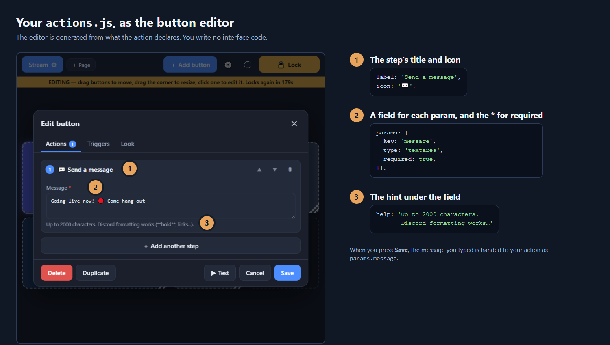

## Step 5: Restart and set it up

1. **Restart VR Macro Pad.** Plugins load once, at startup.
2. Unlock editing and open **Settings → Plugins**. **My Discord Webhook** is in the list.
3. Expand it, paste your webhook URL, and press **Save and test connection**. It should say it found your channel.
4. Click **Save settings**.

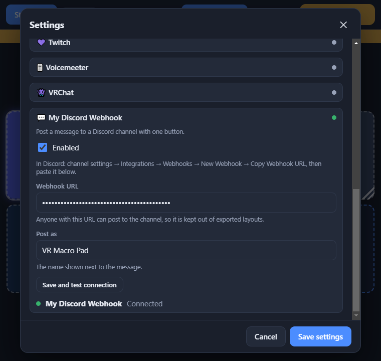

**If your plugin isn't in the list**, look at the top of the same screen. A plugin with a mistake is never
allowed to crash the app: it's skipped and listed there with the reason, and everything else keeps working.

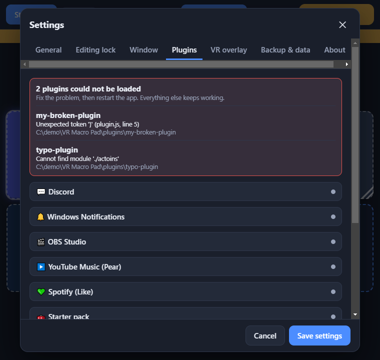

The message names the file and (for a typo) the line. Fix it, then restart.

## Step 6: Put it on a button

1. Click an empty **+** cell on your page (or **Add button**).
2. Search for **mydiscord** or find the **My Discord** heading, and choose **Send a message**.
3. Type your message and press **Save**.
4. Lock editing and press the button. The message appears in Discord, and the button lights up Discord-purple.

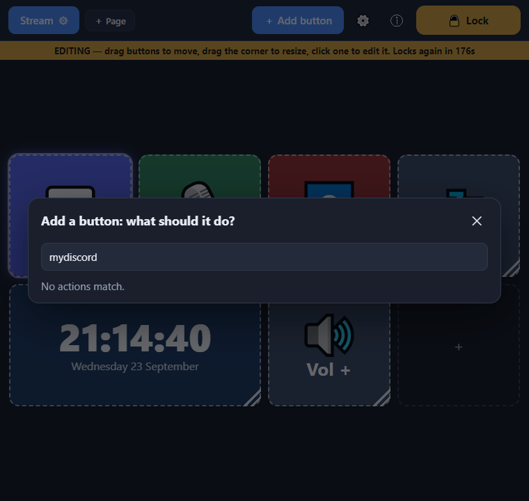

Here's the whole journey once more, from a press to a message:

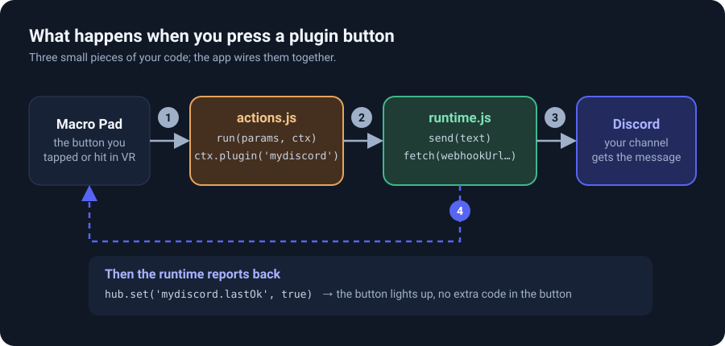

**That's a complete, working plugin.** The finished, tested version of everything above is in
[`docs/example-plugin-discord/`](example-plugin-discord/). Compare against it if anything doesn't match.

---

# Part 2: Cookbook

Short, working recipes for the things people ask for next. Each is tested against the real app.

## Ask the user for choices

Every entry in an action's `params` becomes a field in the button editor:

```js
params: [
  // a list you fill in from code (see optionLists below); allowCustom lets people type their own value too
  { key: 'channel', label: 'Channel', type: 'select', optionsFrom: 'mything.channels', allowCustom: true, required: true },
  // a fixed list: [value, label] pairs
  { key: 'mode', label: 'Mode', type: 'select', options: [['on', 'Turn on'], ['off', 'Turn off'], ['toggle', 'Toggle']], default: 'toggle' },
  // showIf: only visible while another field has one of these values
  { key: 'level', label: 'Level (0-100)', type: 'number', min: 0, max: 100, default: 50, showIf: { key: 'mode', in: ['on'] } },
  { key: 'note', label: 'Note', type: 'textarea' },
  { key: 'loud', label: 'Loud', type: 'boolean', default: false },
],
```

The values arrive in `run(params, ctx)` as `params.channel`, `params.mode`, and so on. Fill a `select` list from
code with `optionLists`, in `plugin.js`:

```js
optionLists: {
  'mything.channels': async (ctx) => [{ value: 'a', label: 'Channel A' }, { value: 'b', label: 'Channel B' }],
},
```

Settings work the same way: `settingsFields` takes the same field types, and your runtime reads them with
`ctx.settings()`. Use **settings** for things set once per plugin (an API key), and **params** for things that
change per button (which message).

## Make buttons light up and fire triggers

A **state key** is a named value your plugin publishes with `ctx.hub.set(...)`. Two things use it:

- **A button's color and label** follow it. In the button editor, the **Color follows** field decides which
  value a button follows. An action's `state` function chooses the default (`state: () => 'mydiscord.lastOk'`).
- **Triggers** on any button can fire when it changes ("when Discord delivery becomes true"), so other plugins
  and buttons can react to yours.

Declare each key in `plugin.js` so they appear in the pickers:

```js
stateKeys: [
  { key: 'mything.online', label: 'Thing is online', group: 'My Thing' },                 // true / false
  { key: 'mything.level',  label: 'Thing level is…', group: 'My Thing', arg: 'text' },    // a value the person picks
],
```

A plain key holds `true` or `false`: `ctx.hub.set('mything.online', true)`. A key with `arg` holds either a text
value (`'kitchen'`) or an object of `name → true/false`. A button follows one value of it:

```js
ctx.hub.set('mything.level', { kitchen: true, hall: false });   // a button can follow "mything.level=kitchen"
ctx.hub.set('mything.scene', 'Gaming');                          // …or "mything.scene=Gaming"
```

Call `ctx.hub.set` again whenever the value changes; the app only updates the screen when something really changed.
`ctx.hub.get(key)` reads a value back, and `ctx.hub.remove(key)` makes it "unknown" again (the button dims and
shows it's waiting).

## Save data between restarts

`ctx.store` keeps small values in a file that survives restarts. Prefix keys with your plugin's id so they can't
collide with anyone else's:

```js
createRuntime(ctx) {
  return {
    count() {
      const n = (ctx.store.readRuntime()['mything.runs'] || 0) + 1;
      ctx.store.writeRuntime({ 'mything.runs': n });   // merges into the file; other keys are kept
      return n;
    },
  };
},
```

Need a bigger file (a cache, a log)? `ctx.dataDir` is the app's data folder; make a subfolder of your own in it
and use Node's `fs`. For **passwords and tokens**, use `ctx.secrets` instead ([below](#sign-in-to-an-account)).

## Keep a connection or poll a service

If your plugin polls a service, holds a socket open, or keeps a timer, it should only do that while something on
the deck actually uses it. Add `sync(needs)` and `stop()` to the runtime, and tell the app what "using it" means:

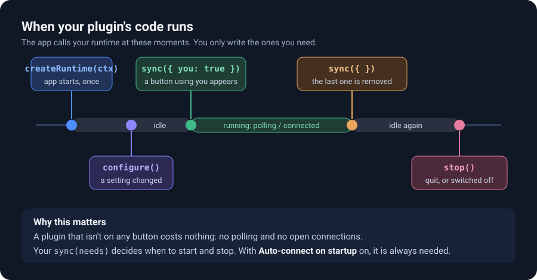

```js
// in actions.js: any button with this action "needs" your plugin
{ id: 'weather.announce', needs: 'weather', /* … */ }

// in runtime.js
class WeatherRuntime {
  constructor(ctx) { this.ctx = ctx; this.timer = null; }
  sync(needs) { if (needs.weather) this.start(); else this.stop(); }   // needs.weather: something uses us
  start() { if (this.timer) return; this.poll(); this.timer = setInterval(() => this.poll(), 60000); }
  stop()  { clearInterval(this.timer); this.timer = null; }
  async poll() { /* fetch, then ctx.hub.set(...) and ctx.emitStatus() */ }
}
```

The key (`weather`) is whatever you write in `needs:` on your actions and widgets. A widget can ask too
(`needs: () => ({ weather: true })`), and a **state key** can: in `plugin.js`, `matchState(key)` returns
`{ weather: true }` for your keys, so a trigger that watches your state also switches you on.

`configure()` is called when a setting changes: reconnect there if a host or port changed.
A working version of all of this is in [`docs/example-plugin/`](example-plugin/).

## Add a mini screen (widget)

A widget is a live display on the deck, like the clock or a battery meter. **You don't write any drawing
code.** Your `data()` returns plain values and the app draws them:

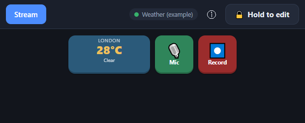

```js
module.exports = [
  {
    id: 'weather.now',
    label: 'Weather (example)',
    description: 'Shows the current temperature and condition. Tap to refresh.',
    icon: '⛅',
    size: { w: 2, h: 1 },               // default size in grid cells
    params: [],
    defaults: { color: '#2b5a7a' },
    interaction: 'tap',                 // 'none' (default) | 'tap' | 'tap-hold'
    needs: () => ({ weather: true }),   // a widget on the page is enough to start polling
    initState: () => ({}),
    data(ctx) {
      const rt = ctx.plugin('weather');  // null if the plugin is off; data() must never throw
      if (!rt) return { subtitle: 'Weather is switched off', status: 'warn' };
      const s = rt.snapshot();
      if (!s.available) return { subtitle: s.error || 'Loading…', status: 'error' };
      return { value: `${s.tempC}°C`, subtitle: s.condition, status: s.tempC >= 25 ? 'warn' : 'ok' };
    },
    async command(ctx, button, state, cmd) {   // a tap arrives as cmd === 'tap', a long press as 'hold'
      if (cmd !== 'tap') return;
      const rt = ctx.plugin('weather');
      if (rt) await rt.poll();
    },
  },
];
```

What `data()` may return (all optional, extra fields are ignored):

| Field | Draws |
|---|---|
| `value` | The big text |
| `subtitle` | The smaller line under it (`title` is used if there is no subtitle) |
| `progress` | A bar, from `0` to `1` |
| `status` | `'ok'` (green), `'warn'` (amber) or `'error'` (red) tint on the value |
| `items` | Up to 12 rows of `{ label, value }` |

The button's own label becomes the small caption at the top. `data()` runs often, so keep it cheap (read what the
runtime already has; don't fetch inside it). If `data()` ever throws, the widget shows the error instead of
breaking the page.

## Sign in to an account

For a service that needs a real login (Twitch, YouTube, Spotify…), a plugin adds a `connect()` step. **Settings
draws the whole Connect experience for you**: the Connect button, the device-code box, the "waiting for you to
approve" state, Disconnect, and an **Auto-connect on startup** switch.

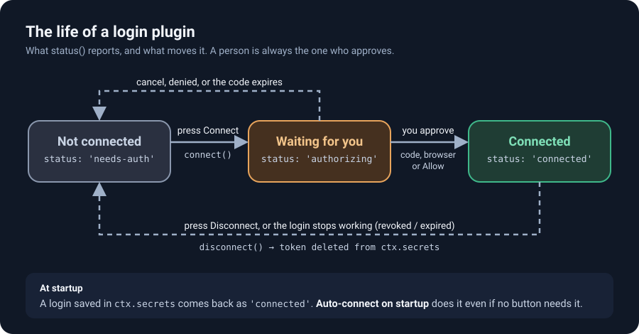

You add three things to `plugin.js`:

```js
connections: [{ id: 'main', label: 'My Service account', flow: 'device' /* or 'redirect', 'approve' */ }],
clientMethods: ['connect', 'disconnect'],     // the only runtime methods the browser may call
externalDomains: ['example.com'],             // sign-in pages the app may open in the browser
```

…and two methods on the runtime, plus a `status()` that reports where you are:

```js
async connect()    { /* request a code, show it, poll until approved, save the token */ return { verificationUri, userCode }; }
async disconnect() { /* delete the token, go back to 'needs-auth' */ return true; }
status() { return { status: 'needs-auth', error: '', user: null, pending: null }; }
```

Rules that make it work well:

- **`connect()` must return quickly**, with the link/code to show. Keep polling in the background and call
  `ctx.emitStatus()` when the state changes. If `connect()` waited for the person to finish approving, the code
  would never be shown.
- **Store the token in `ctx.secrets`**, never in `settingsFields` or a file of your own:
  `ctx.secrets.set('token', …)`, `.get('token')`, `.delete('token')`. It's kept per plugin (other plugins can't read
  it) and encrypted with the person's Windows account when the app can.
- **Restore it on startup**: read `ctx.secrets.get('token')` in your constructor and start in `'connected'`.
- **Never start a fresh sign-in on your own.** Only a person can approve one. *Auto-connect on startup* only
  wakes a saved login up early.
- Report a `pending: { userCode, verificationUri }` while waiting and the box shows the code and an "Open" button
  for you.

A complete, runnable version (with a fake service so it works without any account) is in
[`docs/example-plugin-login/`](example-plugin-login/). The real ones are `plugins/twitch/` (device code),
`plugins/spotify/` (redirect) and `plugins/pear/` (local approval): copy whichever is closest to your service.

## Use npm packages

Your plugin folder can contain its own `node_modules`. Run `npm install some-package` inside the plugin's folder
(this needs [Node.js](https://nodejs.org) on your computer, but only for you as the author) and `require('some-package')` works.

- **Ship the `node_modules` folder with your plugin.** People who install it don't run `npm`.
- The app's own packages are *not* available to plugins (`require('ws')` fails unless you install it in your folder).
- Node's built-in modules (`fs`, `path`, `os`, `crypto`, `child_process`, `http`…) always work.
- Native add-ons (packages that compile C/C++ code) usually don't work, because they must match the app's Electron.

---

# Part 3

## Reference

**Manifest (`plugin.js`)**

| Field | What it does |
|---|---|
| `id` `name` | Required. `id`: 2-40 characters, lowercase letters, numbers, hyphens, starting with a letter |
| `version` `description` `icon` | Shown in Settings. `icon` is one emoji |
| `actions` | Things a button can do (below) |
| `widgets` | Mini screens ([cookbook](#add-a-mini-screen-widget)) |
| `stateKeys` | Values buttons can follow and triggers can watch. `{ key, label, group, arg? }` |
| `settingsFields` | Fields in your Settings card. `enabled` and `autoConnect` are reserved names |
| `instructions(status)` | Setup text shown at the top of your card |
| `testOptionKind` | Adds "Save and test connection", calling this `optionLists` entry |
| `optionLists` | `{ 'name': async (ctx) => [{ value, label }] }`, for `select` fields and the test button |
| `statusHints` | `{ 'some-status': 'text' }` shown next to the dot for that status |
| `connections` `clientMethods` `externalDomains` | A login flow ([cookbook](#sign-in-to-an-account)) |
| `matchState(key)` | Return `{ yourNeedsKey: true }` for your state keys, so watching them switches you on |
| `needsKeys` | Only if your `sync()` checks a different name than your `id` (used by Auto-connect) |
| `createRuntime(ctx)` | Returns your runtime object |

**Actions (`actions.js`)**

| Field | What it does |
|---|---|
| `id` `label` `category` `icon` `description` | Required `id`, must be unique across all plugins: use `yourplugin.something` |
| `params` | Editor fields (types below) |
| `run(params, ctx)` | Does the work. Throw an `Error` to show a red notification |
| `needs` | A key (`'weather'`) or `(params) => ({ … })`: switches your runtime on while a button uses it |
| `state(params)` | Returns the state key a button follows by default |
| `defaults` | Pre-fills a new button: `label`, `labelOn`, `icon`, `color`, `colorOn`, `confirm` (`'none'`, `'hold'` or `'double'`) |

**Field types (`params` and `settingsFields`)**

| `type` | Notes |
|---|---|
| `text` | `placeholder`, `suggestions: [...]` |
| `password` | Masked, and blanked in exported layouts |
| `number` | `min`, `max` |
| `boolean` | A checkbox |
| `select` | `options: [[value, label]]` or `optionsFrom: 'listName'`; `allowCustom`, `emptyLabel` |
| `multiselect` | Same options; the value is an array |
| `textarea` | Several lines |
| `keys` | A keyboard-shortcut recorder |
| `notice` | Not a field: a highlighted message in the editor (`title`, `text`, and `level: 'warn'` or `'info'`). Saves nothing. Good for a warning, like "this posts pictures automatically" |

Any field also takes `label`, `help`, `default`, `required`, and (params only) `showIf: { key, in: [...] }`.

**What every action's `ctx` has:** `plugin(id)` (a runtime; throws a clear error if it's missing or switched off),
`hub`, `toast(text, level)` (`'info'`, `'warn'`, `'error'`; also written to Info → Activity), `osc` / `oscTo` (send OSC),
`mediaControl(app, cmd)` / `nowPlaying()` (Windows media), `patchSettings(fn)`, `helper`.

**What your runtime's `ctx` has:** `id`, `hub`, `now()`, `settings()` (your fields, always current), `emitStatus()`,
`secrets` (`get` `set` `delete`), `store` (`readRuntime` `writeRuntime`), `dataDir`, `winHelper(kind)`,
`osc` / `oscListen(port, host)`, `plugins.get(otherId)`, `coreSettings()`.

**Runtime methods (all optional):** `configure()`, `sync(needs)`, `stop()`, `status()`, plus anything listed in
`clientMethods`. `status()` returns `{ state, error }` where `state` is one of `off`, `connecting`, `connected`,
`error` (login plugins use `status` with `needs-auth`, `authorizing`, `connected`).

**`ctx.hub`:** `set(key, value)`, `get(key)`, `remove(key)`.

**Limits and guarantees**

- Action and widget ids must be unique across every plugin; a clash refuses the whole plugin and says which id.
- A plugin that fails to load, or throws in `createRuntime`, `configure`, `sync`, `stop`, `status`, `needs`, `state`
  or a widget's `data()`, never crashes the app or other plugins. The error shows once in Info → Activity and on the
  plugin's card.
- Plugins load at startup only. Files must be plain CommonJS JavaScript, and icons are emoji.
- The full contract, with every option, is in [PLUGIN-GUIDE.md](PLUGIN-GUIDE.md).

## Testing and debugging

- **Test button.** In the button editor, **▶ Test** runs the button's steps right away, without saving. Errors appear
  as notifications.
- **See what happened.** `ctx.toast('something', 'info')` shows a notification *and* records it in
  **Info → Activity**. It's the easiest way to print a value.
- **`console.log`** works too, but the installed app has no console window. If you run the app from its source
  (`npm run dev`, which prints where its data folder is; set `VRMD_DATA_DIR` to use your own), the output
  appears in that terminal, and plugins go in that data folder's `plugins` folder.
- **Restart after every change.** Plugins load once at startup.
- **Errors are specific.** A missing file names the file; a typo names the file and line; a bad manifest says what's
  wrong ("actions[0] needs a string "id""). Read the red box at the top of Settings → Plugins first.
- **Automated tests** (optional, for people running from source): `createApp({ dataDir, pluginsDir })` loads plugins
  from any folder, which is how this project tests its own. See `test/plugin-safety.test.js`.

## Sharing your plugin

1. **Put a README in the folder** saying what it does, what to paste where, and which service it talks to.
2. **Zip the plugin's folder** (so the zip contains `mydiscord\plugin.js`, not loose files). If you used npm packages,
   include `node_modules`.
3. **Tell people how to install it:** *extract the folder into `%APPDATA%\VR Macro Pad\plugins\`, so that
   `plugins\mydiscord\plugin.js` exists, then restart the app.* Warn them about the nested-folder mistake.
4. **Bump `version`** in `plugin.js` when you change it, and say so in your release notes.
5. **Be upfront about what it does.** Say if it uses the network, reads files, or starts programs. People are
   trusting your code, so keep it readable and don't hide anything in it.
6. **Never put your own keys in it.** Anything in the folder is public once shared. Let people bring their own key
   through `settingsFields`.

## FAQ

**Do I need to be a programmer?** Some JavaScript helps. Plenty of useful plugins are 20 lines. See
[Need a hand?](#need-a-hand) if you'd like help writing one.

**Do I need to restart the app to see my changes?** Yes. Plugins load once, at startup.

**Can I use TypeScript, ES modules or a bundler?** `plugin.js` must be plain CommonJS. You can write TypeScript
elsewhere and ship the compiled `.js`. `import`/`export` syntax in the files the app loads directly isn't supported.

**Can a plugin add its own pictures, colors or windows?** No. A plugin describes its settings, actions and widgets,
and the app draws them. That's what keeps every plugin consistent and safe to load. The icon is an emoji, and
widgets draw from the fields listed above.

**Can I have two Discord webhooks?** Yes: make the URL a `param` of the action (`type: 'password'`) instead of a
plugin-wide setting, so every button can point somewhere different.

**How do I make my plugin do something when something else happens?** Publish a state key (or watch someone else's).
Any button can have a trigger on it. Plugins can also read each other's runtimes with `ctx.plugins.get(id)`.

**Can a plugin register a global hotkey?** Not directly. Hotkeys are set per button, in the button's triggers.

**How does my plugin talk to another program on my PC?** Over the network (`fetch`, `http`, or a WebSocket package
you install with npm) or with Node's `child_process` to run a program.

**Does my plugin's data go into exported layouts?** Only `settingsFields` and button `params`, and not
`type: 'password'` ones. `ctx.secrets` and `ctx.store` are never exported.

**What happens if I delete a plugin?** Buttons that used it show an error when pressed instead of crashing anything.
Its secrets stay in the app's secrets file under that plugin's name, so putting the plugin back reconnects without
signing in again.

**How do I update or remove a plugin?** Replace or delete its folder and restart. Or switch it off with the
**Enabled** box on its card without deleting anything.

**Is a plugin safe to install?** It runs with your permissions, so it's as safe as the person who wrote it.
Read the code, and prefer plugins you can read. The app protects itself from a *buggy* plugin, not a *malicious* one.

## Troubleshooting

| Problem | Likely cause and fix |
|---|---|
| The plugin isn't in Settings → Plugins | The folder isn't directly inside `plugins\` (or is nested twice), `plugin.js` is missing, or you didn't restart. See [Step 1](#step-1-make-the-folder). |
| A red box at the top says a plugin "could not be loaded" | Read the message. A typo gives the file and line; "Cannot find module" means a `require('./x')` points at a missing or misspelled file. |
| "actions[0] needs a string "id"" (or similar) | The manifest is missing a required field. The message says which one. |
| "…already taken by another plugin" | Two actions or widgets share an id, in your plugin or with another one. Use `yourplugin.something`. |
| "Another plugin already uses the id …" | Two plugin folders declare the same `id`. Change one. |
| A reserved-name error for `enabled` or `autoConnect` | Rename that settings field: those two are added for you. |
| The plugin's card shows a red error | Your runtime threw in `createRuntime()`, `sync()`, `configure()` or `status()`. The text is your error message. |
| A button says the plugin "is not loaded" | The id passed to `ctx.plugin('…')` must match your manifest `id` exactly. |
| A button says the plugin "is disabled" | The **Enabled** box on the plugin's card is off. |
| The button is dimmed | Its state is "unknown". Call `ctx.hub.set(key, false)` at startup for keys buttons follow. |
| The widget says something went wrong | Your `data()` threw. The text is the error. |
| My change doesn't appear | Restart the app. |
| It works for me but not for someone I sent it to | Nested folder from unzipping, a missing `node_modules` folder, or a `require` of a package you never bundled. |
| Discord says the webhook doesn't exist (404) | The webhook was deleted or the URL is cut off. Copy it again. |

## Need a hand?

**Need help making a plugin? Try Claude!** 🤖 I'll help you make your own for free, or I can build everything
you need with Claude Pro.

Paste this whole guide into a chat at [claude.ai](https://claude.ai), tell it what you want your plugin to do
("post to my Discord when I go live", "show my server's player count"), and it can walk you through building it
step by step. The free plan is enough for that. If you'd like it to do the work for you,
[Claude Code](https://claude.com/product/claude-code) on a paid plan (Claude Pro, for example) can write the
plugin, run it and test it, then hand you a folder that's ready to drop in.

A tip for the best results: paste this guide, then describe the service you want to connect to and what each
button should do. Mention whether it needs you to sign in.

Happy building!
