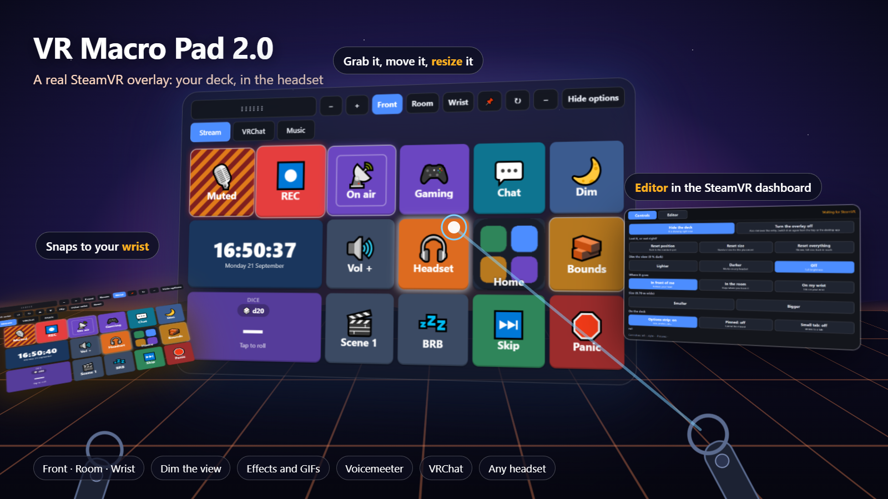

# The VR overlay (SteamVR)

[← Back to the README](../README.md) · [Full guide](GUIDE.md)

VR Macro Pad 2.0 is a **real SteamVR overlay**: your deck floats in the headset, you point a controller at it and pull the
trigger. It works next to XSOverlay and OVR Toolkit, and with any headset that runs through SteamVR (Quest over Link / Air Link /
Virtual Desktop, Index, Vive, Pimax, Steam Frame streaming from a PC...). It does not need a window capture, and the desktop
window keeps working: both show the same deck and follow each other live.

## Turn it on

1. Settings → **VR overlay** → tick **Show the deck in SteamVR** → Save. (Or the tray menu → *Show in SteamVR*.)
2. Start SteamVR. The deck appears in front of you the first time SteamVR is running. The app never starts SteamVR itself.

It only connects to a SteamVR that is already running, and it keeps trying until you start one.

## Moving it around

| | |
|---|---|
| **Grab** | Hold the trigger on the dotted handle at the top and move your hand. A quick click on the handle picks it up and it stays on your hand until you click again. |
| **In front of me** | Follows your head (default). |
| **In the room** | Stays where you leave it. Walk around it. |
| **On my wrist** | Carry it to your other hand and let go: it snaps on. Turn, tilt and flip it with the buttons that appear, or let go near the wrist again to re-set the angle. It remembers the angle per controller type and hand. Let go anywhere else and it leaves the wrist and stays in the room. |
| **Bigger / smaller** | **−** and **+** on the strip, or Settings → VR overlay. |
| **Pin** | Locks it in place so it cannot be grabbed by accident. |
| **↻ Bring back** | Puts it back in reach if you lose it. |
| **Hide options** | Hides the strip so only your buttons stay. The small **⚙** brings it back. |
| **Only when I look at it** | Made for the wrist: the deck only shows while you look at it. |

## The SteamVR dashboard

While the overlay is on, **VR Macro Pad** appears in the bar at the bottom of the SteamVR menu. It has two tabs:

* **Controls**: show / hide the deck, **reset position / size / everything** (for when it is lost), choose front / room / wrist, size,
  **dim the view**, pin, hide the options strip, wrist angle buttons, and **turn the overlay off**.
* **Editor**: the whole app inside VR. Unlock editing (hold the lock), then add, move and change buttons with the laser.
  Drop-downs and the colour picker are drawn by the app (native pop-ups are not visible in VR), text boxes open SteamVR's
  keyboard, and the thumbstick scrolls.

## Dim the view

A dark sheet in front of your eyes for any headset (it does not depend on the headset driver). The deck and the dashboard stay
bright. Set it in Settings, on the dashboard, or with the *Dim the view* button action.

## Settings worth knowing

* **How pictures reach SteamVR**: *Smooth* (GPU textures, default) or *Compatible* (copies pixels, can flicker). The app checks
  that the smooth way really arrived and falls back by itself.
* **Sharpness**: 768 to 2048 pixels wide. Bigger is sharper and heavier.
* **Only show it while I am looking at it**, **Opacity**, **Curve**, **Pages shown in VR**, **Hotkey to hide / show it**.
* Settings → Window → **Start with no window (only the tray icon)**, also in the tray menu, for people who only use VR.

## If something is wrong

* Nothing shows: is SteamVR running? Settings → VR overlay shows the state. The log is `overlay.log` in `%APPDATA%\VR Macro Pad`.
* It blinks: switch *How pictures reach SteamVR* to *Compatible* (or the other way round) and tell us which worked.
* It is lost: dashboard → Controls → **Reset everything**, or the ↻ button on the deck.
* Buttons do not respond to the laser: make sure the deck is not pinned behind another overlay; try **Bring back**.
